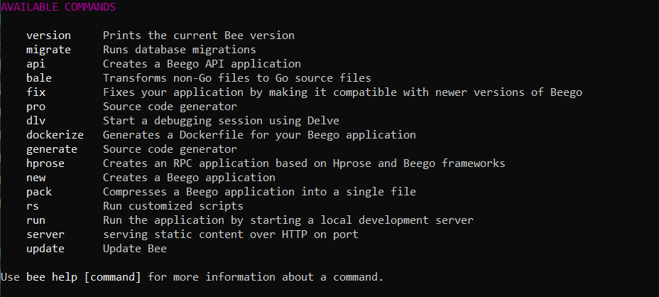
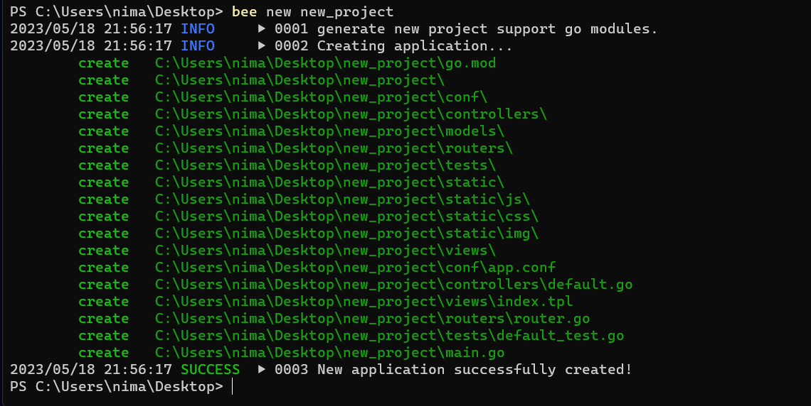
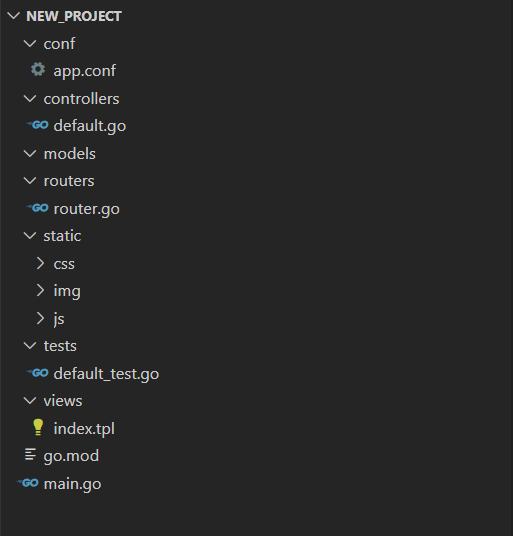
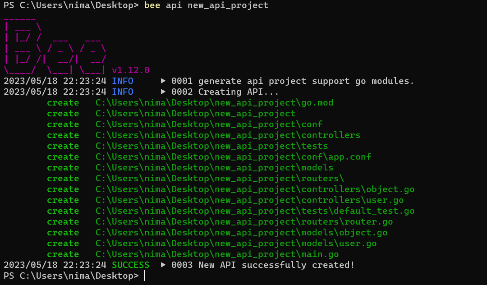
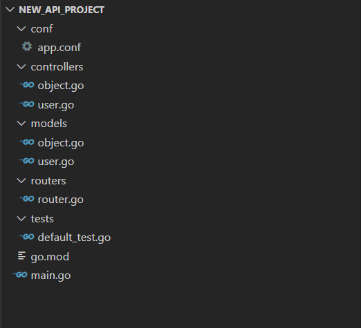
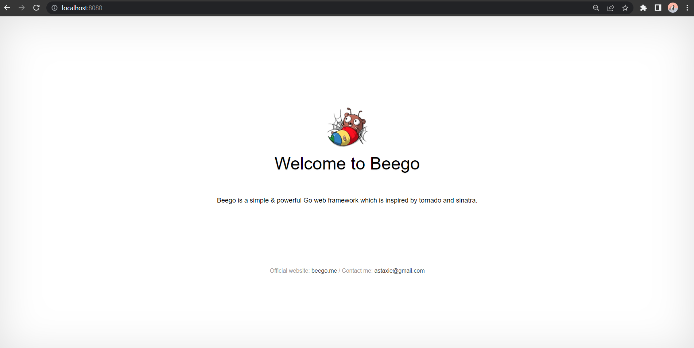
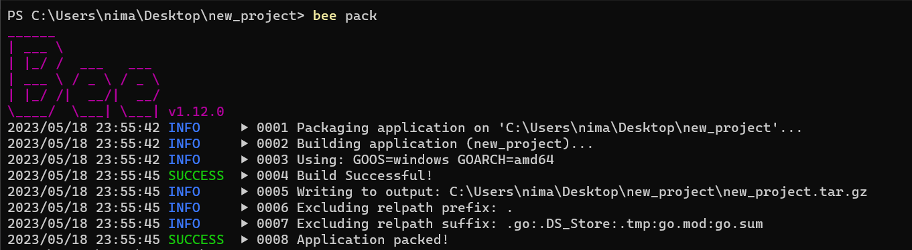
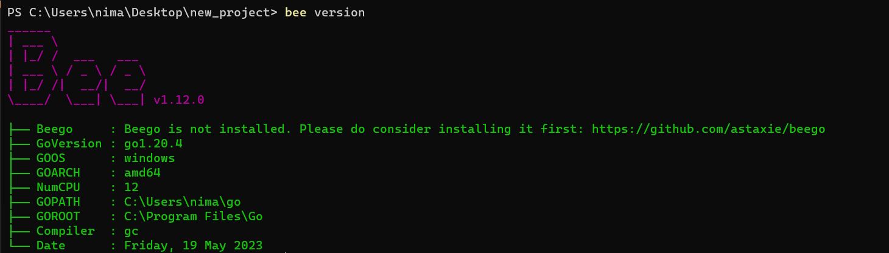
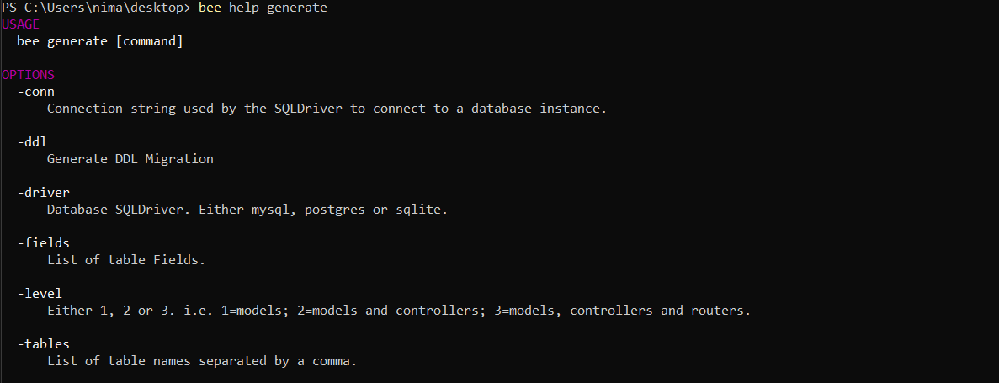

<div dir="rtl">

## داک استفاده از ابزار `bee`

### 📝فهرست
 - [نصب bee](#نصب-bee)
 - [دستورات bee](#دستورات-bee)
 - [کانفیگ ابزار bee](#کانفیگ-ابزار-bee)

## نصب bee
برای نصب `bee` دستور زیر را اجرا کنید:

```bash
go install github.com/beego/bee@latest
```
برای آپدیت کردن نسخه `bee` نیز میتوانید از دستور زیر استفاده کنید:(دستور bee update نیز این کار را میکند.)

```bash
go get -u github.com/beego/bee/v2@latest
```

در صورت نیاز باید `GOPATH/bin` را به path خود اضافه کنید. در بعضی از 
سیستم عامل ها به صورت خودکار انجام میگیرد.


## دستورات bee

 - دستورات `bee` در تصویر پایین آمده اند که با تایپ `bee` در ترمینال نمایش داده میشوند. حال به بررسی هر یک میپردازیم.

 <p align=center></p>

## دستور new<br>
  دستور `new` یک پروژه وب جدید ایجاد میکند. شما میتوانید با دستور زیر یک پروژه جدید beego درست کنید که فایل ها و پوشه های پیشفرض را ایجاد میکند.

<div dir="ltr">

```bash
bee new <project_name>
```
</div>

 <p align=center></p>

 <p align=center></p>

 ## دستور api

 دستور `api` یک اپلیکیشن API جدید ایجاد میکند. در پایین سینتکس دستور `api` و نتیجه اجرای آن را میبینید:

 <div dir="ltr">

```bash
bee api <project_name>
```
</div>

 <p align=center></p>

ساختار یک پروژه API جدید:

 <p align=center></p>

اگر دو دستور `api` و `new` را با هم مقایسه کنیم متوجه میشویم که در new_api_project پوشه های `static` و `views` را نداریم.

<br>

همچنین شما میتوانید مدل و کنترلر خود را بر اساس اسکیم دیتابیس مورد نظر ایجاد کنید.

```bash
bee api [app_name] [-tables=""] [-driver=mysql] [-conn=root:@tcp(127.0.0.1:3306)/test]
```

## دستور run

دستور `bee run` بر روی سیستم فایل بندی پروژه بیگو نظارت میکند. این دستور از [inotify](https://en.wikipedia.org/wiki/Inotify)
استفاده میکند. در صورت هر تغییر در پوشه های بیگو نتایج به صورت خودکار کامپایل شده و همان لحظه نشان داده میشوند.

به صورت پیشفرض پروژه شما بر روی پورت 8080 در آدرس `http://localhost:8080/` نمایش داده میشود.


 <p align=center></p>

 شما میتوانید پیشفرض ها را در فایل `defaults.go` در پوشه `controllers` تغییر دهید.

## دستور pack

با دستور `pack` میتوانید محتویات پروژه خود را در یک فایل فشرده سازی کنید . فایل فشرده را می توان با آپلود و استخراج در سرور مستقر کرد.

 <p align=center></p>

<p align=center></p>

## دستور bale

این دستور در حال حاضر فقط برای تیم توسعه دهنده در دسترس است. با استفاده از آن میتوان تمام فایل های استاتیک را درون یک فایل باینری ریخت به این منظور که دیگر نیازی به حمل فایل های استاتیک (js , css , images , views) نباشد. زمانی که برنامه شروع به کار کرد،فایل‌ها به صورت خودکار استخراج می‌شوند.

## دستور version

با استفاده از این دستور میتوان ورژن `go` , `bee` , `beego` را مشاهده کرد.

<p align=center></p>

توجه کنید که `bee` ورژن `beego` را از آدرس 
<div dir = ltr>

`$GOPATH/src/astaxie/beego directory` 
</div>

 متوجه میشود و اگر `beego` را در این آدرس نصب نکردید و از GOMOD  استفاده کرده اید ، `bee` قادر به پیدا کردن ورژن `beego` نخواهد بود.


## دستور generate

این دستور روترها را با تجزیه و تحلیل توابع موجود در کنترلرها تولید می کند. در تصاویر زیر آپشن های این دستور را مشاهده میکنید.

<p align=center></p>

- برای ساخت scaffold از کل برنامه شما از دستور زیر استفاده کنید:

<div dir="ltr">

```bash
bee generate scaffold [scaffoldname] [-fields="title:string,body:text"] [-driver=mysql] [-conn="root:@tcp(127.0.0.1:3306)/test"]
```

</div>

- برای ایجاد مدل بر اساس فیلد ها از دستور زیر استفاده کنید:

<div dir="ltr">

```bash
bee generate model [modelname] [-fields="name:type"] 
```

</div>

- برای ایجاد کنترلر از دستور زیر استفاده کنید:

<div dir="ltr">

```bash
bee generate controller [controllerfile]
```

</div>

- برای ایجاد یک crud view از دستور زیر استفاده کنید:

<div dir="ltr">

```bash
bee generate view [viewpath]
```

</div>

- برای ایجاد یک [فایل migration](https://docs.djangoproject.com/en/4.2/topics/migrations/#:~:text=it's%20not%20supported.-,Migration%20files,%2C%20models%20class%20Migration\(migrations.)  به منظور ایجاد آپدیت های دیتابیس از دستور زیر استفاده کنید:

<div dir="ltr">

```bash
bee generate migration [migrationfile] [-fields="name:type"] 
```

</div>

- برای ایجاد یک [فایل داک swagger](https://swagger.io/docs/specification/about/) از دستور زیر استفاده کنید:

<div dir="ltr">

```bash
bee generate docs
```

</div>

- برای ایجاد تست کیس از دستور زیر استفاده کنید:

<div dir="ltr">

```bash
bee generate test [routerfile]  
```

</div>

- برای ایجاد یک appcode بر اساس دیتابیس موجود از دستور زیر استفاده کنید:

<div dir="ltr">

```bash
bee generate appcode [-tables=""] [-driver=mysql] [-conn="root:@tcp(127.0.0.1:3306)/test"] [-level=3] 
```

</div>

## دستور migrate

این دستور اسکریپت های migration دیتابیس را اجرا میکند.

- برای اجرای تمام migration ها از دستور زیر استفاده کنید:

<div dir="ltr">

```bash
bee migrate [-driver=mysql] [-conn="root:@tcp(127.0.0.1:3306)/test"] [-dir="path/to/migration"]
```

</div>

- برای ریست migration قبل از دستور زیر استفاده کنید:

<div dir="ltr">

```bash
bee migrate rollback [-driver=mysql] [-conn="root:@tcp(127.0.0.1:3306)/test"] [-dir="path/to/migration"]
```

</div>

- برای انجام ریست کل migration ها از دستور زیر استفاده کنید:

<div dir="ltr">

```bash
bee migrate reset [-driver=mysql] [-conn="root:@tcp(127.0.0.1:3306)/test"] [-dir="path/to/migration"] 
```

</div>

- برای آپدیت طرحواره خود از دستور زیر استفاده کنید:

<div dir="ltr">

```bash
bee migrate refresh [-driver=mysql] [-conn="root:@tcp(127.0.0.1:3306)/test"] [-dir="path/to/migration"] 
```

</div>

## دستور dockerize

دستور `dockerize` یک dockerfile برای برنامه beego شما ایجاد میکند ، dockerfile کامپایل شده و وابستگی ها را از `godep` دریافت میکند و entrypoint را تنظیم میکند.

گزینه های این دستور عبارت اند از:

<div dir="ltr">

- `-expose=8080`

</div>

پورت یا پورت هایی که از طریق آنها docker-container قابل رویت است.

<div dir="ltr">

- `-image=library/golang`

</div>

image پایه docker container شما را مشخص میکند.

مثال:

<div dir="ltr">

```bash
bee dockerize -expose="3000,80,25"
```

</div>

## دستور dlv

`bee` با استفاده از ابزار دیباگ [delve](https://github.com/gadelkareem/delve) یک debug session ایجاد میکند.

گزینه های این دستور عبارت اند از:


<div dir="ltr">

- `-port=8181`

</div>

پورتی که برای client به آن گوش میدهد.

<div dir="ltr">

- `-package`

</div>

مشخص کردن پکیج مورد نظر برای دیباگ

<div dir="ltr">

- `-verbose=false`

</div>

فعال سازی حالت verbose


## دستور server

یک api application با گزینه های داده شده برای شما میسازد.

flagهای این دستور:

<div dir="ltr">

- `-a`

</div>

آدرس گوش دادن

<div dir="ltr">

- `-f`

</div>

fold کردن فایل های استاتیک

<div dir="ltr">

- `-p`

</div>

پورت گوش دادن 


## کانفیگ ابزار bee

فایل `bee.json` در پوشه سورس کد ابزار bee ، فایل کانفیگ beego است. این فایل همچنان در حال توسعه است ولی چند گزینه  آن در حال حاضر قابل استفاده هستند:

<div dir="ltr">

- `"version": 0`

</div>

ورژن فایل را نمایش میدهد برای چک کردن ورژن فرمت ناسازگار.

<div dir="ltr">

- `"go_install": false`

</div>

اگر از یک import path کامل استفاده میکنید، میتوانید با فعال سازی این گزینه ، `go install` را اجرا کنید و فرایند build خود را سرعت ببخشید.

<div dir="ltr">

- `"watch_ext": []`

</div>

با این گزینه میتوانید فایل ها با اکستنشن های دیگر را نیز زیر نظر قرار دهید.(مثل .ini , .conf , ...)

<div dir="ltr">

- `"dir_structure":{}`

</div>

اگر نام های پوشه های شما مثل نام های کلسیک MVC باشد شما میتوانید با استفاده از این گزینه آنها را تغییر دهید.

<div dir="ltr">

- `"cmd_args": []`

</div>

برای هر start ،میتوانید آرگومان های دستور اضافه کنید.

<div dir="ltr">

- `"envs": []`

</div>

قرار دادن environment variables برای هر start.


