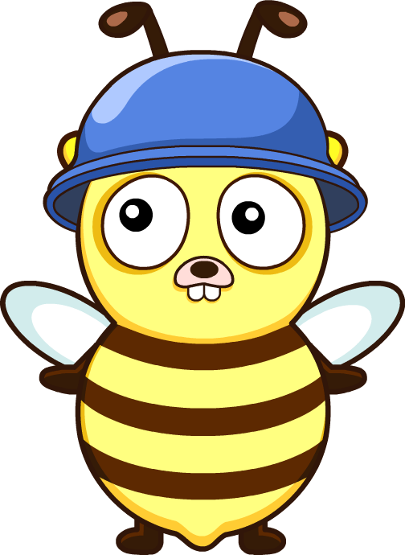

## Beego

### 📝فهرست
 - [آشنایی با فریمورک بیگو](./Introduction)
 - [آموزش راه اندازی و ساخت یک پروژه با فریمورک بیگو](./Tutorial)
 - [داک استفاده از ابزار bee](./Bee_Documentation)

### ✍️نویسندگان

 - [نیما میری](https://github.com/NimaEnigma)
 - [نیکان واسعی](https://github.com/NikanV)
 - [علیرضا کاظمینی](https://github.com/alirezakazemeini)

