<div dir="rtl">

## آموزش راه اندازی و ساخت یک پروژه با فریمورک بیگو

### 📝فهرست
 - [پیش نیاز ها]()
 - [ساختن اولین برنامه]()
 - [ساختن controller و router]()
 - [ساختن view]()
 - [اضافه کردن پایگاه داده redis]()


## پیش نیاز ها
- زبان برنامه نویسی GO

برای نصب آن می توانید از این [وبسایت](https://go.dev/dl/) اقدام کنید.
توجه کنید که حتما Environment Variable مربوط به GOPATH را در کامپیوتر خود تنظیم کنید.

در linux با اجرای دستور زیر:

```bash
export PATH=$PATH:/usr/local/go/bin
```

و در windows با رفتن به تنظیمات Environment Variables و اضافه کردن یک Variable به اسم `GOPATH` و با مقدار `%USERPROFILE%\go`
می توانید این کار را انجام دهید.

- کتابخانه های beego و bee

برای نصب کتابخانه beego می توانید از دستور زیر استفاده کنید:

```bash
go install github.com/beego/beego/v2@latest
```

و برای نصب کتابخانه bee هم می توانید از دستور زیر استفاده کنید:

```bash
go install github.com/beego/bee@latest
```

اگر همه مراحل را درست انجام داده باشید با استفاده از دستور `bee` می توانید توضیحات مربوط به دستورات آن را مشابه عکس زیر ببینید.

<p align=center>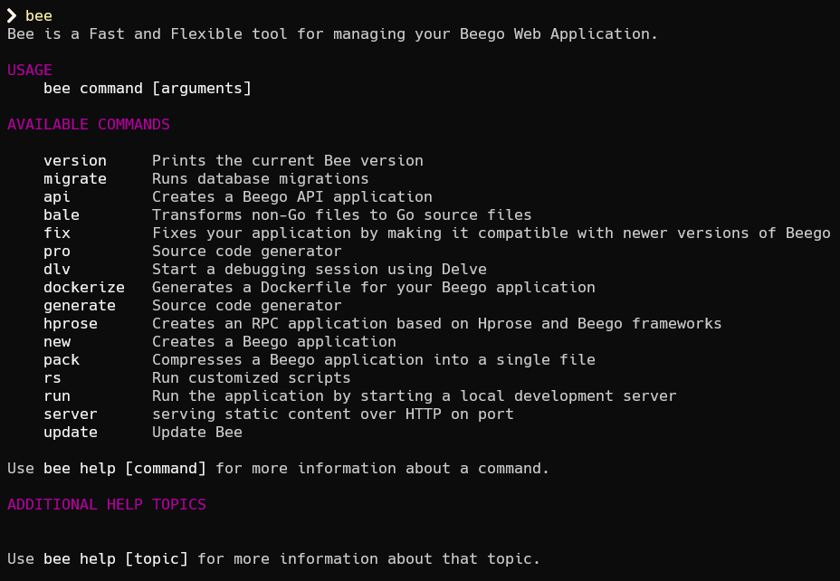</p>

## ساختن اولین برنامه
ابتدا به فولدری که می خواهید در آن پروژه را بسازید بروید. به عنوان مثال اسم فولدر من `demo_project` هست.

سپس با استفاده از دستور زیر می توانید پروژه خود را بسازید.

```bash
bee new your_project_name
```

و به جای `your_project_name` هر اسمی که می خواهید برای پروژه خود انتخاب کنید را قرار دهید.
پس از اجرای دستور بالا پیغامی مشابه زیر دریافت خواهید کرد.

<p align=center></p>

اکنون اگر به فولدر ساخته شده با اسمی که انتخاب کردید بروید، فایل های پروژه را می بینید که توسط beego  برای شما ساخته شده اند.

<p align=center>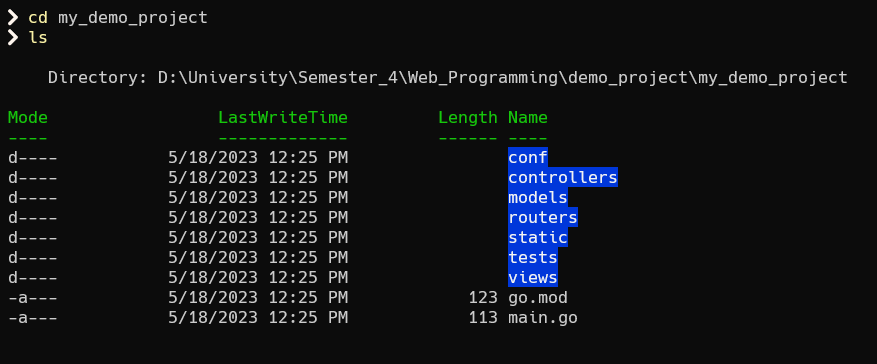</p>

بعد از ساخت پروژه کافی است ابتدا کتابخانه های مربوطه را بریزید که به راحتی با دستور زیر قابل انجام است:

```bash
go mod tidy
```

می توانید در این [لینک](https://go.dev/ref/mod#go-mod-tidy) توضیحات مربوط به دستور بالا را ببینید.

پس از نصب کتابخانه های مربوطه می توانید با استفاده از دستور زیر پروژه خود را اجرا کنید:

```bash
bee run
```

وقتی پروژه اجرا می شود، صفحه ای مانند صفحه زیر خواهید داشت:

<p align=center>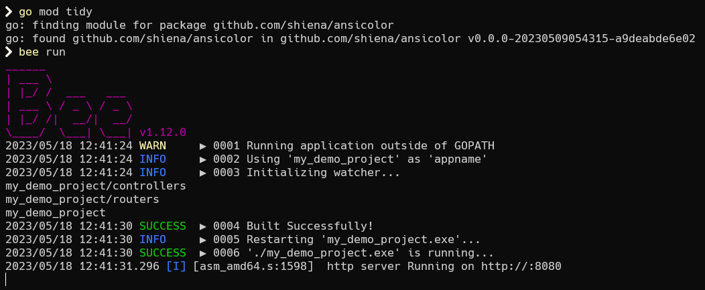</p>

پروژه به صورت پیش فرض روی پورت 8080 مربوط به localhost بالا می آید.
پس با رفتن به URL زیر می توانید نمای اولیه سایت خود را ببینید.

```http
http://localhost:8080/
```

<p align=center>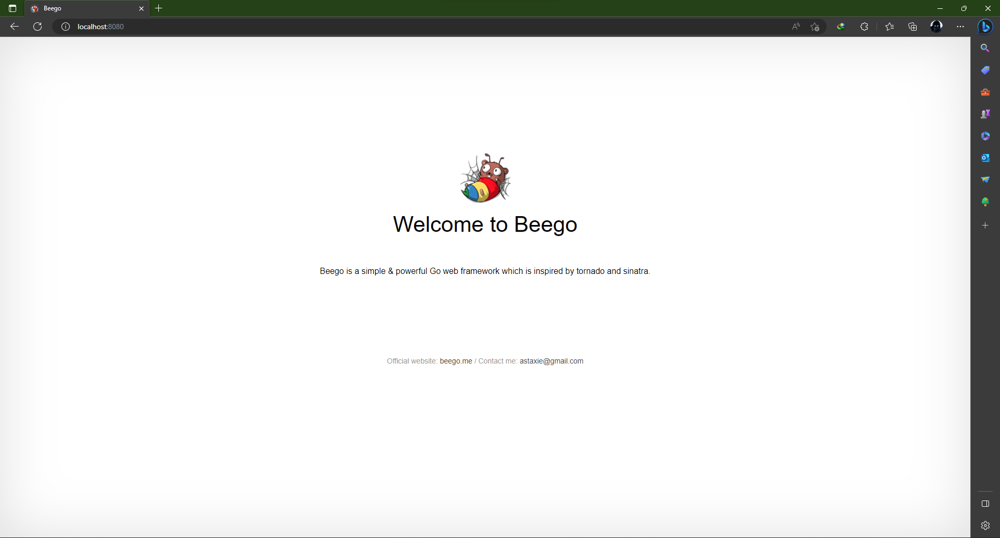</p>

در ادامه خواهیم دید که چه طور به پروژه خود controller، view و خیلی قابلیت های دیگر اضافه کنیم.

## ساختن controller و router 

برای اضافه کردن یک controlller کافی است به فولدر مربوط به آن بریم و یک فایل با پسوند `go.` بسازیم.

<p align=center>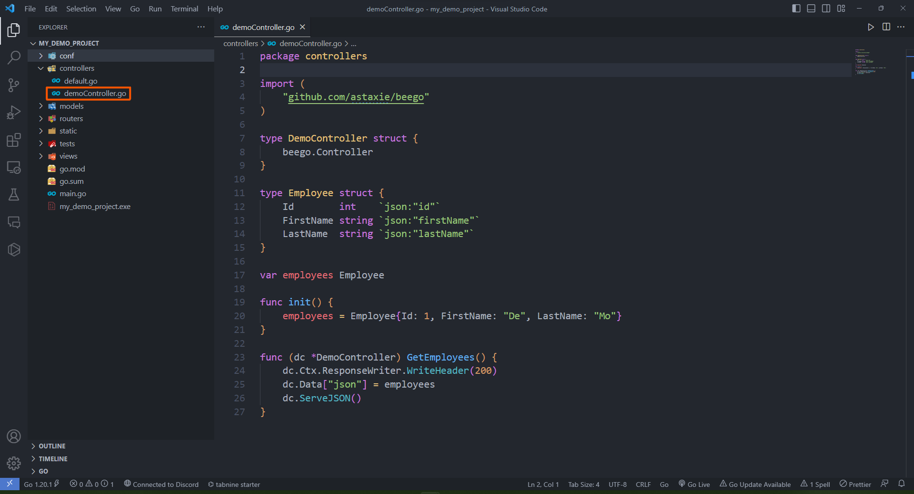</p>

در فایل controller ابتدا یک struct تعریف می کنیم و بهتر است اسم آن مشابه اسم فایلی که ساختیم باشد و داخل آن `beego.Controller` را به عنوان پدر می نویسیم زیرا که هر controller ی که می سازیم باید فرزند `beego.Controller` باشد. پس در واقع داریم struct embedding انجام می دهیم.

```golang
type DemoController struct {
	beego.Controller
}
```

برای مطالعه بیشتر struct embedding می توانید از این [لینک](https://gobyexample.com/struct-embedding) استفاده کنید.

سپس به عنوان مثال یک struct از کارمندان ساختیم به نام `Employee` که دارای سه تا فیلد نوشته شده هست.
سپس برای controller ی که بالاتر تعریف کردیم یک تابع می نویسیم که برای ما مشخصات کارمندان را با فرمت json بر می گرداند.

```golang
type Employee struct {
	Id        int    `json:"id"`
	FirstName string `json:"firstName"`
	LastName  string `json:"lastName"`
}

func (dc *DemoController) GetEmployees() {
	dc.Ctx.ResponseWriter.WriteHeader(200)
	dc.Data["json"] = employees
	dc.ServeJSON()
}
```

برای مطالعه درباره نحوه نوشتن struct های مناسب با json و کار کردن با json در زبان GO می توانید از این [لینک](https://gobyexample.com/json) و این [لینک](https://go.dev/blog/json) استفاده کنید.

در آخر هم یک تابع به نام init داریم که این تابع هنگام ساخته شدن این controller صدا زده می شود، پس در واقع مقادیری را که لازم است در ابتدا مقدار دهی کنیم می توانیم در این تابع قرار دهیم.

```golang
func init() {
	employees = Employee{Id: 1, FirstName: "De", LastName: "Mo"}
}
```

برای اضافه کردن router هم کافی است به فایل `router.go` در فولدر `routers` رفته و router مربوط به این controller ی که زدیم را اضافه کنیم.

<p align=center>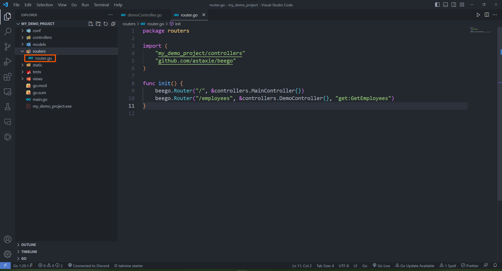</p>

تنها خطی که لازم است اضافه کنیم خط زیر می باشد و کاری که انجام می دهد این است که به router می گوید که اگر در url آدرس /employess نوشته شده بود با استفاده از controller ی که به عنوان دومین آرگومان به آن پاس داده شده و تابعی از همین controller که به عنوان سومین آرگومان به آن پاس داده شده برای من یک response برگرداند.

```golang
	beego.Router("/employees", &controllers.DemoController{}, "get:GetEmployees")
```

همچنین در آرگومان سوم نوشتیم `get:GetEmployees` و می دانیم که طرف راست `:` همان اسم تابع است. اما طرف چپ آن در واقع نوع درخواست http ما است که می توانید با مراجعه به این [لینک](https://developer.mozilla.org/en-US/docs/Web/HTTP/Methods) بیشتر درمورد آنها مطالعه کنید.

اکنون اگر دوباره پروژه را اجرا کنیم و به URL زیر برویم با همچین صفحه ای که در واقع همان response تابع `()GetEmployees` هست مواجه می شویم.

```http
http://localhost:8080/employees
```

<p align=center>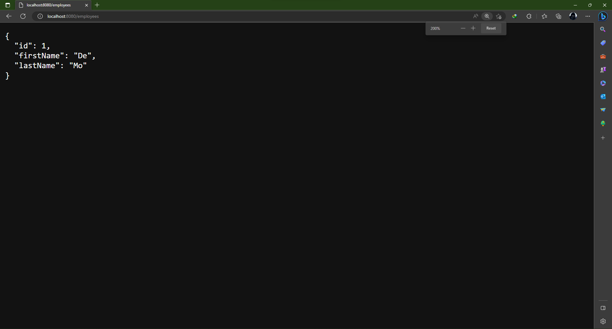</p>

به همین صورت می توانیم هر controller ی که می خواهیم بسازیم و با router ها به هر URL ی که می خواهیم یک handler و یا تابعی از یک controller را نسبت بدهیم.

## ساختن view

برای اضافه کردن یک view مشابه قسمت قبل به فولدر مربوطه رفته و یک فایل با پسوند `tpl.` بسازید.

فایل های با پسوند `tpl.` فایل های Smarty هستند که به ما اجازه نوشتن همزمان html، css و یکسری syntax دیگر را می دهند. برای مطالعه بیشتر می توانید از این [لینک](https://smarty-php.github.io/smarty/4.x/) استفاده کنید.

<p align=center>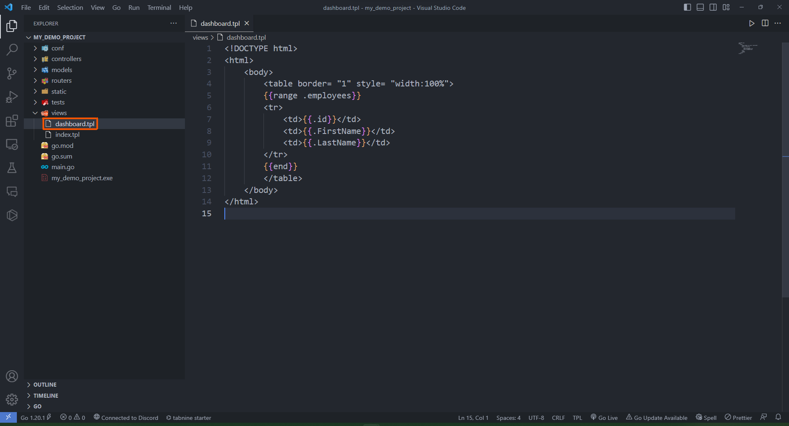</p>

در این فایل به عنوان نمونه یک جدول تعریف کردیم و با استفاده از `range` روی همه مقادیر `employees` یک حلقه زدیم و فیلد های مربوط به آنها را در یک جدول وارد کردیم.

```html
<!DOCTYPE html>
<html>
    <body>
        <table border= "1" style= "width:100%">
        {{range .employees}}
        <tr>
            <td>{{.Id}}</td>
            <td>{{.FirstName}}</td>
            <td>{{.LastName}}</td>
        </tr>
        {{end}}
        </table>
    </body>
</html>
```

بعد از اضافه کردن این فایل view باید تابعی در controller مربوطه تعریف کنیم که وظیفه کنترل این view را دارد.
<br>
برای این کار به فایل controller ی که قبل تر ساختیم می رویم و تابع زیر را به آن اضافه می کنیم.

```golang
func (dc *DemoController) Dashboard() {
	dc.Data["employees"] = employees
	dc.TplName = "dashboard.tpl"
}
```
در این تابع چون قرار است یک view را نشان دهیم پس باید اسم فایل مربوط به آن را در تابع تنظیم کنیم که این کار با مقداردهی  `dc.TplName` قابل انجام است.
<br>

همچنین چون در فایل view از متغیر `employees` استفاده کردیم، پس باید آن را به لیست داده های این controller اضافه کنیم که این کار هم با اضافه کردن متغییر به `dc.Data` انجام پذیر است.

همچنین به این توجه کنید که در فایل view بالا از `range` استفاده کردیم، چون می خواستیم مقادیری را به متغییر `employee` اضافه کنیم تا بهتر بتوانیم نتیجه را ببینیم.
پس متغییر `employees` را به شکل زیر در همان controller 
قبلی تعریف می کنیم.

```golang
var employees []Employee

func init() {
	employees = []Employee{{Id: 1, FirstName: "De", LastName: "Mo"},
	{Id: 2, FirstName: "Ran", LastName: "Dom"},
	{Id: 3, FirstName: "He", LastName: "Llo"}}
}
```

و در نهایت باید مشابه قبل router مربوط به تابع جدید اضافه شده در controller را اضافه کنیم.

```golang
	beego.Router("/dashboard", &controllers.DemoController{}, "get:Dashboard")
```

برای دسترسی به این تابع هم می توانیم URL زیر را در نظر بگیریم.

```http
http://localhost:8080/dashboard
```

در نهایت با اجرای برنامه و رفتن به URL بالا می توانید صفحه زیر را مشاهده کنید.

<p align=center>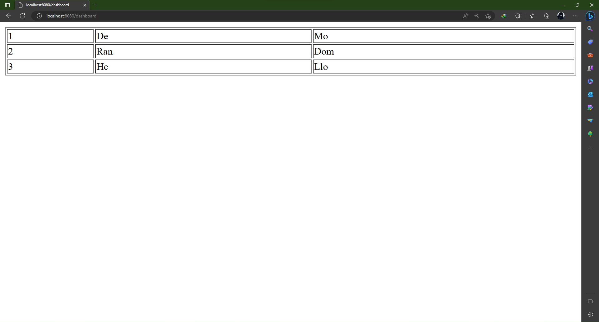</p>

به همین صورت می توانیم هر view ی که می خواهیم بسازیم و آن را به controller و router مربوطه اش متصل کنیم.

تا اینجا توانستیم یک پروژه عادی را بالا بیاریم و یکسری controll، router و view داشته باشیم. اما در ادامه یاد می گیریم که چگونه از یکسری قابلیت های پیشرفته تر beego و یا از یک پایگاه داده مثل redis استفاده کنیم.


## اضافه کردن پایگاه داده redis

در ابتدا باید redis را نصب کنیم. برای نصب آن در windows باید از `WSL` استفاده کنید که از این [لینک](https://learn.microsoft.com/en-us/windows/wsl/install) می توانید استفاده کنید برای نصب `WSL` در windows. و اگر هم linux دارید و یا `WSL` را نصب کرده اید می توانید با استفاده از دستورات زیر یا مراجعه به این [لینک](https://redis.io/docs/getting-started/installation/install-redis-on-linux/) به نصب redis بپردازید.

```bash
curl -fsSL https://packages.redis.io/gpg | sudo gpg --dearmor -o /usr/share/keyrings/redis-archive-keyring.gpg

echo "deb [signed-by=/usr/share/keyrings/redis-archive-keyring.gpg] https://packages.redis.io/deb $(lsb_release -cs) main" | sudo tee /etc/apt/sources.list.d/redis.list

sudo apt-get update
sudo apt-get install redis
```

پس از نصب باید `redis-server` را با دستور زیر شروع کنیم:

```bash
sudo service redis-server start
```

در ادامه می خواهیم یک HomePage داشته باشیم که تنها کارمندی که login کرده است اجازه دسترسی به آن را داشته باشد. و برای این کار یک تابع login و logout هم تعریف می کنیم.

در این قسمت برای پیاده سازی پروژه و استفاده از redis از `session variable` ها استفاده می کنیم.

در همین راستا ابتدا یک controller جدید به نام `sessionController` می سازیم که همان طور که بالاتر گفتیم دارای تابع های مربوط به Home، Login و Logout می باشد.

<p align=center></p>

در ابتدا مشابه بقیه controller ها struct زیر را تعریف می کنیم.

```golang
type SessionController struct {
	beego.Controller
}
```
و در ادامه 
در تابع مربوط به Home چک می کنیم که کارمند login کرده باشد و اگر نکرده بود تابع خطا بدهد.

```golang
func (sc *SessionController) Home() {
	isAuthenticated := sc.GetSession("authenticated")
	if isAuthenticated == nil || isAuthenticated == false {
		sc.Ctx.WriteString("You are unauthorized to view the page.")
		return
	}
	sc.Ctx.ResponseWriter.WriteHeader(200)
	sc.Ctx.WriteString("Home Page")
}
```
و
در تابع های مربوط به Login و Logout به ترتیب مقدار session مربوطه را `true` و `false` می کنیم.

```golang
func (sc *SessionController) Login() {
	sc.SetSession("authenticated", true)
	sc.Ctx.ResponseWriter.WriteHeader(200)
	sc.Ctx.WriteString("You have successfully logged in.")
}

func (sc *SessionController) Logout() {
	sc.SetSession("authenticated", false)
	sc.Ctx.ResponseWriter.WriteHeader(200)
	sc.Ctx.WriteString("You have successfully logged out.")
}
```

پس از ساختن این controller باید router های مربوط به آن را در فایل `router.go` اضافه کنیم.

```golang
    beego.Router("/home", &controllers.SessionController{}, "get:Home")
	beego.Router("/login", &controllers.SessionController{}, "get:Login")
	beego.Router("/logout", &controllers.SessionController{}, "get:Logout")
```

اکنون در این مرحله باید به فایل `main.go` رفته و redis را هم import کنیم.

قبل از آن اگر redis را در GO  نصب نکرده اید با استفاده از دستور های زیر این کار را بکنید.

```bash
go get github.com/redis/go-redis/v9
go mod tidy
```
سپس آن را import کنید.

```golang
	_ "github.com/astaxie/beego/session/redis"
```

و در مرحله آخر هم باید `Session Variables` ی که گفته بودیم را در فایل `app.conf` تعریف کنیم.

```golang
SessionOn = true
SessionProvider = "redis"
SessionProviderConfig = "127.0.0.1:6379"
```

آدرس تعریف شده در متغیر `SessionProviderConfig` همان آدرسی است که سرویس redis را روی آن بالا آوردیم.

اکنون اگر برنامه را اجرا کنیم و سعی کنیم قبل از login کردن وارد URL زیر بشویم با error زیر مواجه خواهیم شد.

```http
https://localhost:8080/home
```

<p align=center>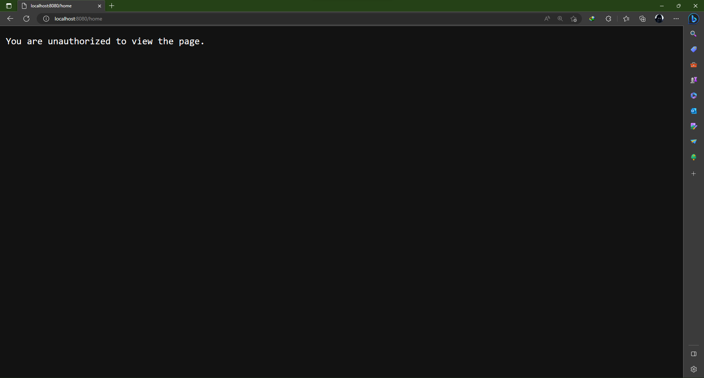</p>

اما اگر ابتدا با رفتن به آدرس زیر login کنیم و با cookie بدست آمده که در شکل زیر هم مشخص است به صفحه Home برویم می توانیم آن را ببینیم.

<p align=center>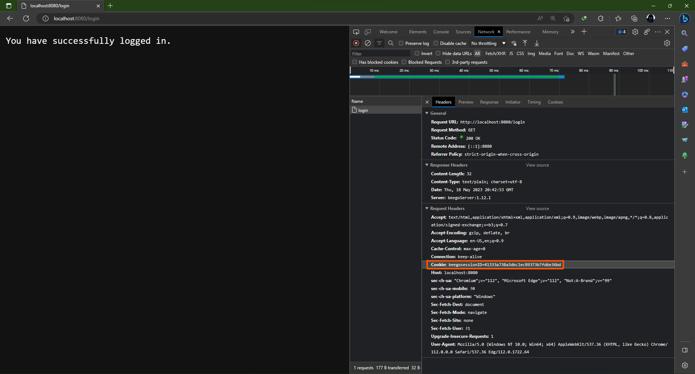</p>

در شکل زیر چون در browser هستیم cookie ما به صورت خودکار اعمال می شود اما اگر با استفاده از ابزار هایی مثل cURL می خواهیم این کار را انجام دهیم باید در فیلد مربوطه مثل
 `cookie--` آن را وارد کنیم.


</div>