<div dir="rtl">

## آموزش راه اندازی و ساخت یک پروژه با فریمورک بیگو

### 📝فهرست
 - [پیش نیاز ها](#پیش-نیاز-ها)
 - [ساختن اولین برنامه](#ساختن-اولین-برنامه)
 - [اضافه کردن Controller و Router](#اضافه-کردن-controller-و-router)
 - [اضافه کردن View](#ساختن-view)
 - [استفاده از پایگاه داده Redis](#استفاده-از-پایگاه-داده-redis)
   - [نصب و راه اندازی](#نصب-و-راه-اندازی)
   - [اضافه کردن Session Variable](#اضافه-کردن-session-variable)
 - [اضافه کردن Filter](#اضافه-کردن-filter)
 - [مدیریت Error ها](#مدیریت-error-ها)
 - [نحوه monitor کردن برنامه](#نحوه-monitor-کردن-برنامه)
 - [مستقر کردن برنامه روی دستگاه local](#مستقر-کردن-برنامه-روی-دستگاه-local)
 - [مستقر کردن برنامه روی nginx](#مستقر-کردن-برنامه-روی-nginx)
   - [نصب و راه اندازی](#d986d8b5d8a8-d988-d8b1d8a7d987-d8a7d986d8afd8a7d8b2db8c-1)
 - [منابع](#منابع)

## پیش نیاز ها
- زبان برنامه نویسی GO

برای نصب آن می توانید از این [وبسایت](https://go.dev/dl/) اقدام کنید.
توجه کنید که حتما Environment Variable مربوط به GOPATH را در کامپیوتر خود تنظیم کنید.

در linux با اجرای دستور زیر:

```bash
export PATH=$PATH:/usr/local/go/bin
```

و در windows با رفتن به تنظیمات Environment Variables و اضافه کردن یک Variable به اسم `GOPATH` و با مقدار `%USERPROFILE%\go`
می توانید این کار را انجام دهید.

- کتابخانه های beego و bee

برای نصب کتابخانه beego می توانید از دستور زیر استفاده کنید:

```bash
go install github.com/beego/beego/v2@latest
```

و برای نصب کتابخانه bee هم می توانید از دستور زیر استفاده کنید:

```bash
go install github.com/beego/bee@latest
```

اگر همه مراحل را درست انجام داده باشید با استفاده از دستور `bee` می توانید توضیحات مربوط به دستورات آن را مشابه عکس زیر ببینید.

<p align=center></p>

## ساختن اولین برنامه
ابتدا به فولدری که می خواهید در آن پروژه را بسازید بروید. به عنوان مثال اسم فولدر من `demo_project` هست.

سپس با استفاده از دستور زیر می توانید پروژه خود را بسازید.

```bash
bee new your_project_name
```

و به جای `your_project_name` هر اسمی که می خواهید برای پروژه خود انتخاب کنید را قرار دهید.
پس از اجرای دستور بالا پیغامی مشابه زیر دریافت خواهید کرد.

<p align=center>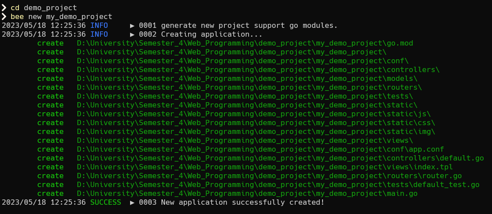</p>

اکنون اگر به فولدر ساخته شده با اسمی که انتخاب کردید بروید، فایل های پروژه را می بینید که توسط beego  برای شما ساخته شده اند.

<p align=center></p>

بعد از ساخت پروژه کافی است ابتدا کتابخانه های مربوطه را بریزید که به راحتی با دستور زیر قابل انجام است:

```bash
go mod tidy
```

می توانید در این [لینک](https://go.dev/ref/mod#go-mod-tidy) توضیحات مربوط به دستور بالا را ببینید.

پس از نصب کتابخانه های مربوطه می توانید با استفاده از دستور زیر پروژه خود را اجرا کنید:

```bash
bee run
```

وقتی پروژه اجرا می شود، صفحه ای مانند صفحه زیر خواهید داشت:

<p align=center></p>

پروژه به صورت پیش فرض روی پورت 8080 مربوط به localhost بالا می آید.
پس با رفتن به URL زیر می توانید نمای اولیه سایت خود را ببینید.

```http
http://localhost:8080/
```

<p align=center></p>

در ادامه خواهیم دید که چه طور به پروژه خود controller، view و خیلی قابلیت های دیگر اضافه کنید.

## اضافه کردن Controller و Router 

برای اضافه کردن یک controlller کافی است به فولدر مربوط به آن بریم و یک فایل با پسوند `go.` بسازیم.

<p align=center></p>

در فایل controller ابتدا یک struct تعریف می کنیم و بهتر است اسم آن مشابه اسم فایلی که ساختیم باشد و داخل آن `beego.Controller` را به عنوان پدر می نویسیم زیرا که هر controller ی که می سازیم باید فرزند `beego.Controller` باشد. پس در واقع داریم struct embedding انجام می دهیم.

```golang
type DemoController struct {
	beego.Controller
}
```

برای مطالعه بیشتر struct embedding می توانید از این [لینک](https://gobyexample.com/struct-embedding) استفاده کنید.

سپس به عنوان مثال یک struct از کارمندان ساختیم به نام `Employee` که دارای سه تا فیلد نوشته شده هست.
سپس برای controller ی که بالاتر تعریف کردیم یک تابع می نویسیم که برای ما مشخصات کارمندان را با فرمت json بر می گرداند.

```golang
type Employee struct {
	Id        int    `json:"id"`
	FirstName string `json:"firstName"`
	LastName  string `json:"lastName"`
}

func (dc *DemoController) GetEmployees() {
	dc.Ctx.ResponseWriter.WriteHeader(200)
	dc.Data["json"] = employees
	dc.ServeJSON()
}
```

برای مطالعه درباره نحوه نوشتن struct های مناسب با json و کار کردن با json در زبان GO می توانید از این [لینک](https://gobyexample.com/json) و این [لینک](https://go.dev/blog/json) استفاده کنید.

در آخر هم یک تابع به نام `init` داریم که این تابع هنگام ساخته شدن این controller صدا زده می شود، پس در واقع مقادیری را که لازم است در ابتدا مقدار دهی کنیم می توانیم در این تابع قرار دهیم.

```golang
func init() {
	employees = Employee{Id: 1, FirstName: "De", LastName: "Mo"}
}
```

برای اضافه کردن router هم کافی است به فایل `router.go` در فولدر `routers` رفته و router مربوط به این controller ی که زدیم را اضافه کنیم.

<p align=center></p>

تنها خطی که لازم است اضافه کنیم خط زیر می باشد و کاری که انجام می دهد این است که به router می گوید که اگر در url آدرس `/employees` نوشته شده بود با استفاده از controller ی که به عنوان دومین آرگومان به آن پاس داده شده و تابعی از همین controller که به عنوان سومین آرگومان به آن پاس داده شده برای من یک response برگرداند.

```golang
	beego.Router("/employees", &controllers.DemoController{}, "get:GetEmployees")
```

همچنین در آرگومان سوم نوشتیم `get:GetEmployees` و می دانیم که طرف راست `:` همان اسم تابع است. اما طرف چپ آن در واقع نوع درخواست http ما است که می توانید با مراجعه به این [لینک](https://developer.mozilla.org/en-US/docs/Web/HTTP/Methods) بیشتر درمورد آنها مطالعه کنید.

اکنون اگر دوباره پروژه را اجرا کنیم و به URL زیر برویم با همچین صفحه ای که در واقع همان response تابع `()GetEmployees` هست مواجه می شویم.

```http
http://localhost:8080/employees
```

<p align=center></p>

به همین صورت می توانیم هر controller ی که می خواهیم بسازیم و با router ها به هر URL ی که می خواهیم یک handler و یا تابعی از یک controller را نسبت بدهیم.

## ساختن View

برای اضافه کردن یک view مشابه قسمت قبل به فولدر مربوطه رفته و یک فایل با پسوند `tpl.` بسازید.

فایل های با پسوند `tpl.` فایل های `Smarty` هستند که به ما اجازه نوشتن همزمان html، css و یکسری syntax دیگر را می دهند. برای مطالعه بیشتر می توانید از این [لینک](https://smarty-php.github.io/smarty/4.x/) استفاده کنید.

<p align=center></p>

در این فایل به عنوان نمونه یک جدول تعریف کردیم و با استفاده از `range` روی همه مقادیر `employees` یک حلقه زدیم و فیلد های مربوط به آنها را در یک جدول وارد کردیم.

```html
<!DOCTYPE html>
<html>
    <body>
        <table border= "1" style= "width:100%">
        {{range .employees}}
        <tr>
            <td>{{.Id}}</td>
            <td>{{.FirstName}}</td>
            <td>{{.LastName}}</td>
        </tr>
        {{end}}
        </table>
    </body>
</html>
```

بعد از اضافه کردن این فایل view باید تابعی در controller مربوطه تعریف کنیم که وظیفه کنترل این view را دارد.
<br>
برای این کار به فایل controller ی که قبل تر ساختیم می رویم و تابع زیر را به آن اضافه می کنیم.

```golang
func (dc *DemoController) Dashboard() {
	dc.Data["employees"] = employees
	dc.TplName = "dashboard.tpl"
}
```
در این تابع چون قرار است یک view را نشان دهیم پس باید اسم فایل مربوط به آن را در تابع تنظیم کنیم که این کار با مقداردهی  `dc.TplName` قابل انجام است.
<br>

همچنین چون در فایل view از متغیر `employees` استفاده کردیم، پس باید آن را به لیست داده های این controller اضافه کنیم که این کار هم با اضافه کردن متغییر به `dc.Data` انجام پذیر است.

همچنین به این توجه کنید که در فایل view بالا از `range` استفاده کردیم، چون می خواستیم مقادیری را به متغییر `employee` اضافه کنیم تا بهتر بتوانیم نتیجه را ببینیم.
پس متغییر `employees` را به شکل زیر در همان controller 
قبلی تعریف می کنیم.

```golang
var employees []Employee

func init() {
	employees = []Employee{{Id: 1, FirstName: "De", LastName: "Mo"},
	{Id: 2, FirstName: "Ran", LastName: "Dom"},
	{Id: 3, FirstName: "He", LastName: "Llo"}}
}
```

و در نهایت باید مشابه قبل router مربوط به تابع جدید اضافه شده در controller را اضافه کنیم.

```golang
	beego.Router("/dashboard", &controllers.DemoController{}, "get:Dashboard")
```

برای دسترسی به این تابع هم می توانیم URL زیر را در نظر بگیریم.

```http
http://localhost:8080/dashboard
```

در نهایت با اجرای برنامه و رفتن به URL بالا می توانید صفحه زیر را مشاهده کنید.

<p align=center></p>

به همین صورت می توانیم هر view ی که می خواهیم بسازیم و آن را به controller و router مربوطه اش متصل کنیم.

تا اینجا توانستیم یک پروژه عادی را بالا بیاریم و یکسری controll، router و view داشته باشیم. اما در ادامه یاد می گیریم که چگونه از یکسری قابلیت های پیشرفته تر beego و یا از یک پایگاه داده مثل redis استفاده کنیم.


## استفاده از پایگاه داده Redis

### نصب و راه اندازی

در ابتدا باید `redis` را نصب کنیم. برای نصب آن در windows باید از `WSL` استفاده کنید که از این [لینک](https://learn.microsoft.com/en-us/windows/wsl/install) می توانید استفاده کنید برای نصب `WSL` در windows. و اگر هم linux دارید و یا `WSL` را نصب کرده اید می توانید با استفاده از دستورات زیر یا مراجعه به این [لینک](https://redis.io/docs/getting-started/installation/install-redis-on-linux/) به نصب `redis` بپردازید.

```bash
curl -fsSL https://packages.redis.io/gpg | sudo gpg --dearmor -o /usr/share/keyrings/redis-archive-keyring.gpg

echo "deb [signed-by=/usr/share/keyrings/redis-archive-keyring.gpg] https://packages.redis.io/deb $(lsb_release -cs) main" | sudo tee /etc/apt/sources.list.d/redis.list

sudo apt-get update
sudo apt-get install redis
```

پس از نصب باید `redis-server` را با دستور زیر شروع کنیم:

```bash
sudo service redis-server start
```

### اضافه کردن Session Variable

در ادامه می خواهیم یک HomePage داشته باشیم که تنها کارمندی که login کرده است اجازه دسترسی به آن را داشته باشد. و برای این کار یک تابع login و logout هم تعریف می کنیم.

در این قسمت برای پیاده سازی پروژه و استفاده از redis از `session variable` ها استفاده می کنیم.

در همین راستا ابتدا یک controller جدید به نام `sessionController` می سازیم که همان طور که بالاتر گفتیم دارای تابع های مربوط به Home، Login و Logout می باشد.

<p align=center>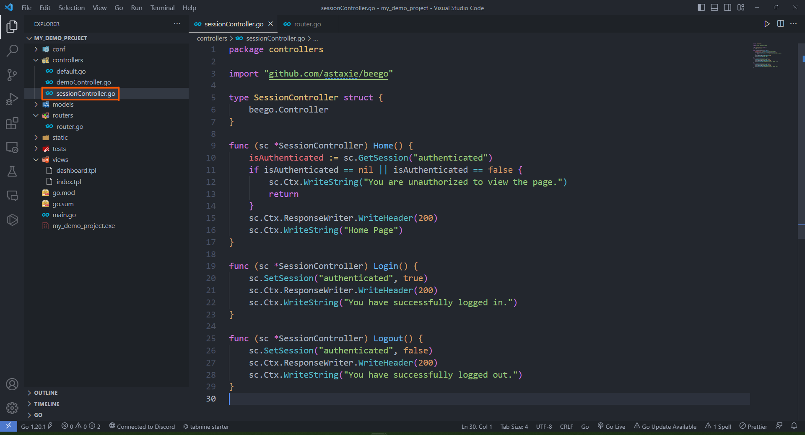</p>

در ابتدا مشابه بقیه controller ها struct زیر را تعریف می کنیم.

```golang
type SessionController struct {
	beego.Controller
}
```
و در ادامه 
در تابع مربوط به Home چک می کنیم که کارمند login کرده باشد و اگر نکرده بود تابع خطا بدهد.

```golang
func (sc *SessionController) Home() {
	isAuthenticated := sc.GetSession("authenticated")
	if isAuthenticated == nil || isAuthenticated == false {
		sc.Ctx.WriteString("You are unauthorized to view the page.")
		return
	}
	sc.Ctx.ResponseWriter.WriteHeader(200)
	sc.Ctx.WriteString("Home Page")
}
```
و
در تابع های مربوط به Login و Logout به ترتیب مقدار session مربوطه را `true` و `false` می کنیم.

```golang
func (sc *SessionController) Login() {
	sc.SetSession("authenticated", true)
	sc.Ctx.ResponseWriter.WriteHeader(200)
	sc.Ctx.WriteString("You have successfully logged in.")
}

func (sc *SessionController) Logout() {
	sc.SetSession("authenticated", false)
	sc.Ctx.ResponseWriter.WriteHeader(200)
	sc.Ctx.WriteString("You have successfully logged out.")
}
```

پس از ساختن این controller باید router های مربوط به آن را در فایل `router.go` اضافه کنیم.

```golang
    beego.Router("/home", &controllers.SessionController{}, "get:Home")
	beego.Router("/login", &controllers.SessionController{}, "get:Login")
	beego.Router("/logout", &controllers.SessionController{}, "get:Logout")
```

اکنون در این مرحله باید به فایل `main.go` رفته و redis را هم import کنیم.

قبل از آن اگر `redis` را در GO  نصب نکرده اید با استفاده از دستور های زیر این کار را بکنید.

```bash
go get github.com/redis/go-redis/v9
go mod tidy
```
سپس آن را import کنید.

```golang
	_ "github.com/astaxie/beego/session/redis"
```

و در مرحله آخر هم باید `Session Variables` ی که گفته بودیم را در فایل `app.conf` تعریف کنیم.

```golang
SessionOn = true
SessionProvider = "redis"
SessionProviderConfig = "127.0.0.1:6379"
```

آدرس تعریف شده در متغیر `SessionProviderConfig` همان آدرسی است که سرویس `redis` را روی آن بالا آوردیم.

اکنون اگر برنامه را اجرا کنیم و سعی کنیم قبل از login کردن وارد URL زیر بشویم با error زیر مواجه خواهیم شد.

```http
https://localhost:8080/home
```

<p align=center></p>

اما اگر ابتدا با رفتن به آدرس زیر login کنیم و با `cookie` بدست آمده که در شکل زیر هم مشخص است به صفحه Home برویم می توانیم آن را ببینیم.

<p align=center></p>

در شکل زیر چون در browser هستیم `cookie` ما به صورت خودکار اعمال می شود اما اگر با استفاده از ابزار هایی مثل cURL می خواهیم این کار را انجام دهیم باید در فیلد مربوطه مثل
 `cookie--` آن را وارد کنیم.

## اضافه کردن Filter

در این مرحله از پیاده سازی می خواهیم `Filter` ها را به پروژه اضافه کنیم.

برای این کار ابتدا باید کتابخانه Context را نصب کنید. با استفاده از دستور زیر این کار را انجام دهید.

```golang
go get github.com/astaxie/beego/context
go mod tidy
```

بعد از نصب کتابخانه Context کافی است به فولدر اصلی یا root پروژه رفته و یک فولدر به اسم `filters` بسازید و درون آن فولدر اولین فایل فیلتر خود را با پسوند `go.` بسازید.

<p align=center>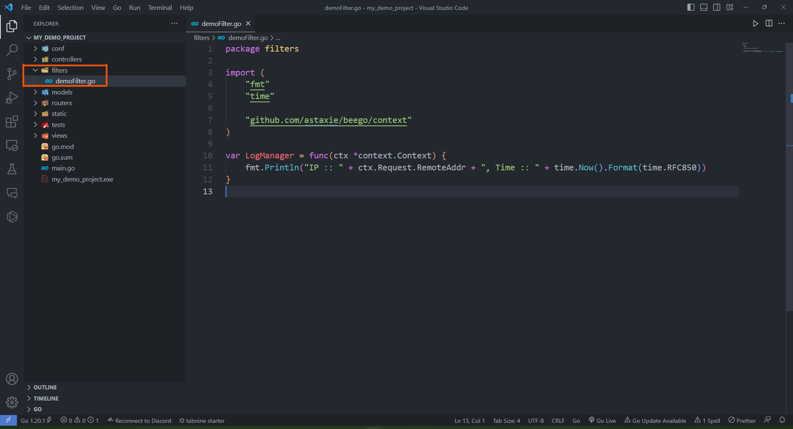</p>

در فایلی که ساختیم ابتدا باید کتابخانه `Context` را import کنیم که به صورت زیر قابل انجام است.

```golang
"github.com/astaxie/beego/context"
```

سپس یک تابع تعریف می کنیم برای مدیریت Log ها و آن را در متغیری به اسم `LogManager` قرار می دهیم.

```golang
var LogManager = func(ctx *context.Context) {
	fmt.Println("IP :: " + ctx.Request.RemoteAddr + ", Time :: " + time.Now().Format(time.RFC850))
}
```

کاری که در این تابع انجام می دهیم این است که یک Context به عنوان ورودی می گیریم و آدرس IP آن و زمانی که این Context آمده را چاپ می کنیم. با این کار انگار که داریم Log می اندازیم.

بعد از تعریف کردن Filter باید مثل Controller ها به آن یک Router وصل کنیم. پس مشابه قبل به فایل `router.go` رفته و خط زیر را اضافه می کنیم.

```golang
	beego.InsertFilter("/*", beego.BeforeRouter, filters.LogManager)
```

دقت کنید که اگر به صورت خودکار فولدر `filters` شما در فایل `router.go` وارد یا import نشد باید به صورت زیر آن را import کنید.

```golang
import "my_demo_project/filters"
```
که البته به جای my_demo_project باید اسم پروژه خود را قرار دهید.

خطی که به `router.go` اضافه کردیم در واقع دارد می گوید که به ازای هر آدرسی از سایت که وارد شد با پوزیشن `beego.BeforeRouter` فیلتری به اسم `filters.LogManager` را اعمال کن.

اکنون اگر پروژه را اجرا کرده و به هر URL ی از آن بروید به صورت زیر در terminal می توانید log ی که تعریف کردیم را مشاهده کنید.

<p align=center>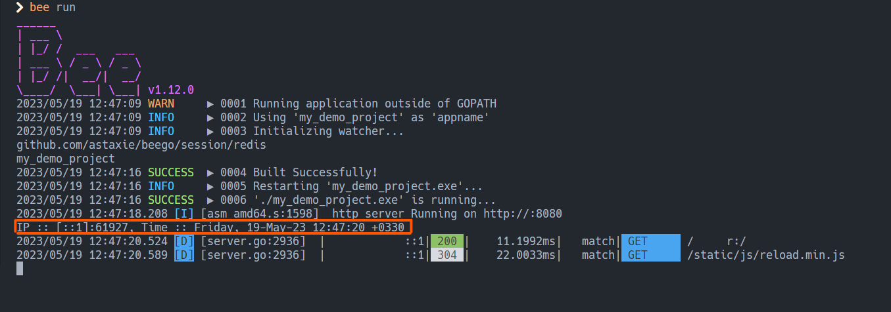</p>

برای مطالعه بیشتر filter ها و انواع پوزیشن های آنها می توانید به این [لینک](https://github.com/beego/beedoc/blob/master/en-US/mvc/controller/filter.md) مراجعه کنید.

## مدیریت Error ها

می دانیم که یکی از مهم ترین بخش های یک web application بخش `Error handling` آن است. پس ما هم در این مرحله یک نمونه ساده از آن را پیاده سازی می کنیم.

برای این کار ابتدا یک controller که وظیفه کنترل error ها را دارد به فولدر controllers اضافه می کنیم.

<p align=center>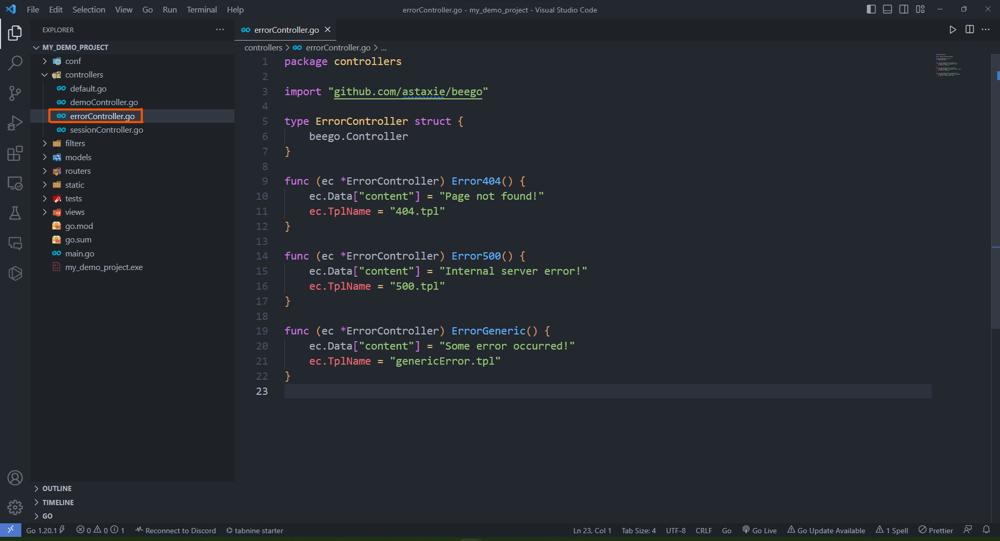</p>

سپس مشابه بقیه controller ها قطعه کد زیر را می نویسیم.

```golang
import "github.com/astaxie/beego"

type ErrorController struct {
	beego.Controller
}
```

سپس برای چند نمونه error تابع های کنترلی آنها را تعریف می کنیم.

```golang
func (ec *ErrorController) Error404() {
	ec.Data["content"] = "Page not found!"
	ec.TplName = "404.tpl"
}

func (ec *ErrorController) Error500() {
	ec.Data["content"] = "Internal server error!"
	ec.TplName = "500.tpl"
}

func (ec *ErrorController) ErrorGeneric() {
	ec.Data["content"] = "Some error occurred!"
	ec.TplName = "genericError.tpl"
}
```

چون قرار است برای error ها یک صفحه جدید نمایش دهیم پس در تابع ها `ec.TplName` و متغیر مربوط به هر فایل `tpl.` را مقدار دهی می کنیم.

اکنون برای اینکه بتوانیم پروژه را واقعی تر کنیم و یکسری error تولید کنیم می توانیم یک تابع به controller مربوط به employees بسازیم که بر حسب `Id` کارمند ها را برگرداند.

```golang
func (dc *DemoController) GetEmployeeID() {
	var id int
	dc.Ctx.Input.Bind(&id, "id")
	var isEmployeeExist bool
	var emps []Employee

	for _, employee := range employees {
		if employee.Id == id {
			emps = append(emps, Employee{Id: employee.Id,
				FirstName: employee.FirstName, LastName: employee.LastName})
			isEmployeeExist = true
			break
		}
	}

	if !isEmployeeExist {
		dc.Abort("Generic")
	} else {
		dc.Data["employees"] = emps
		dc.TplName = "dashboard.tpl"
	}
}
```

در این تابع به صورت کلی داریم روی `employees` حلقه می زنیم و هر کارمندی که `Id` برابری با id داده شده در ورودی داشته باشد را به لیست کارمندانی که خروجی می دهیم اضافه می کنیم. در آخر هم اگر همچین کارمندی وجود نداشت ارور `generic` را بر می گردانیم.

دوباره مشابه قبل باید router مربوط به این تابع را در فایل `router.go` اضافه کنیم.

```golang
beego.Router("/employeesid", &controllers.DemoController{}, "get:GetEmployeeID")
```

در آخر هم صفحه های مربوط به ارور ها را اضافه می کنیم.
به عنوان مثال می توانیم صفحه زیر را در فایلی به اسم `genericerror.tpl` اضافه کنیم.

```html
<!DOCTYPE html>
<html>
    <body>
        {{.content}}
    </body>
</html>
```

اکنون اگر پروژه را اجرا کنیم و به URL زیر برویم می بینیم که به ما کارمندی که `Id` برابر 2 را دارد نشان می دهد.

```http
http://localhost:8080/employeesid?id=2
```

<p align=center>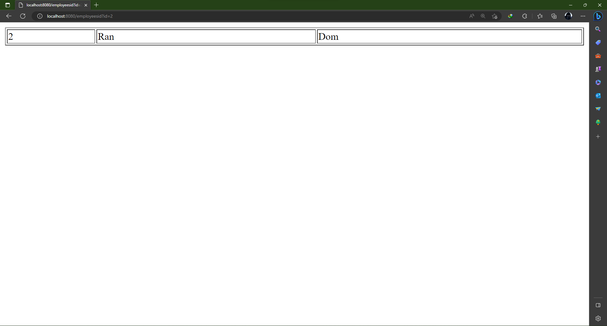</p>

اما اگر به آدرس زیر رفته می بینیم که خطا می دهد چون همچین کارمندی با `Id` برابر با 5 وجود ندارد.

```http
http://localhost:8080/employeesid?id=5
```

<p align=center></p>

به همین صورت می توانیم بقیه انواع ارور ها را هم مدیریت کنیم.

## پیاده سازی Caching

یکی دیگر از کار هایی که می تواند جنبه های زیادی از برنامه ما را بهبود بخشد استفاده از `caching` است.
برای مطالعه بیشتر درباره `caching` در برنامه های تحت وب می توانید از این [لینک](https://aws.amazon.com/caching/web-caching/#:~:text=Caching%20web%20content%20helps%20improve,than%20from%20the%20origin%20servers.) استفاده کنید.

برای استفاده از `caching` باید کتابخانه cache را import کرده باشید.
<br>
اگر این کتابخانه را ندارید می توانید با استفاده از دستور زیر آن را نصب کنید.

```golang
go get github.com/astaxie/beego/cache
go mod tidy
```

سپس یک controller برای کنترل کردن `cache` به اسم `cacheController.go` می سازیم.

<p align=center>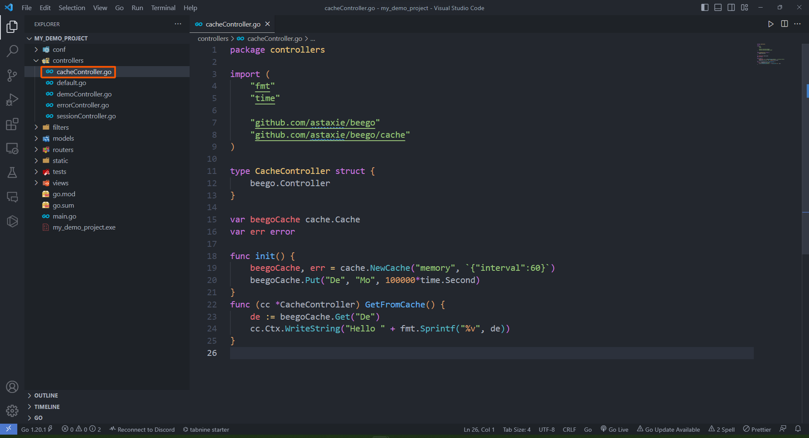</p>

در ابتدای فایل باید کتابخانه های `beego` و `cache` را import کنیم و controller را تعریف کنیم.

```golang
import "github.com/astaxie/beego"
import "github.com/astaxie/beego/cache"

type CacheController struct {
	beego.Controller
}
```

سپس یک متغیر `cache` تعریف می کنیم و آن را در تابع `init` مقدار دهی می کنیم.

```golang
var beegoCache cache.Cache
var err error

func init() {
	beegoCache, err = cache.NewCache("memory", `{"interval":60}`)
	beegoCache.Put("De", "Mo", 100000*time.Second)
}
```

برای مطالعه بیشتر در مورد `cache` در `beego` به این [لینک](https://github.com/beego/beedoc/blob/master/en-US/module/cache.md) مراجعه کنید.

و در نهایت تابع استفاده از `cache` را اضافه می کنیم که برای مقدار متنساب با کلید `De` را بر می گرداند.

```golang
func (cc *CacheController) GetFromCache() {
	de := beegoCache.Get("De")
	cc.Ctx.WriteString("Hello " + fmt.Sprintf("%v", de))
}
```

بعد از ساخت controller اکنون باید router مربوط به آن را هم بسازیم. پس به فایل `router.go` رفته و قطعه کد زیر را اضافه می کنیم.

```golang
	beego.Router("/getfromcache", &controllers.CacheController{}, "get:GetFromCache")
```

اکنون اگر برنامه را  اجرا کنیم و به URL زیر برویم می بینیم که برای ما مقدار متناسب با کلیدی که تعریف کردیم را بر می گرداند.

```html
http://localhost:8080/getfromcache
```

<p align=center>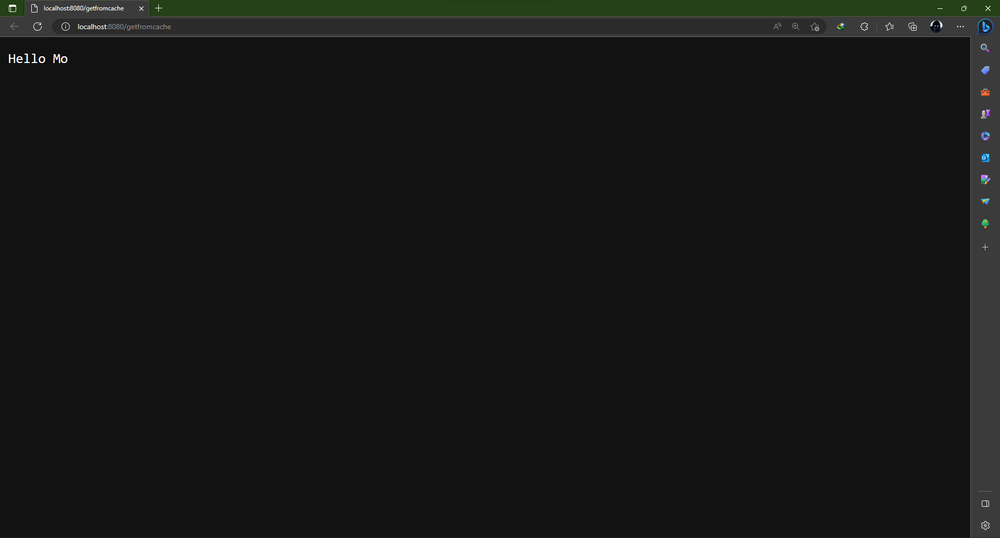</p>

به همین صورت می توانیم مقادیری که می خواهیم را `cache` کنیم و آنها را خروجی دهیم.

## نحوه monitor کردن برنامه

یکی از کار هایی که می تواند به ما در نگه داری از سایتمان کمک کند `monitor` کردن آن است.
<br>
برای مطالعه در مورد انواع روش های `monitoring` می توانید به این [لینک](https://stackify.com/what-is-application-performance-monitoring/#:~:text=Here%20are%20some%20other%20examples,and%20monitoring%20application%20error%20rates.) مراجعه کنید.

برای اضافه کردن این ویژگی به پروژه کافی است خط های زیر را به فایل `app.conf` اضافه کنیم.

```golang
EnableAdmin = true
AdminAddr = "localhost"
AdminPort = 8090
```

اکنون اگر برنامه را اجرا کنیم و به آدرسی کا بالا برای `Admin` در نظر گرفتیم برویم می توانیم به صفحه ی از پیش ساخته شده برای monitor کردن برنامه دسترسی پیدا کنیم.

<p align=center>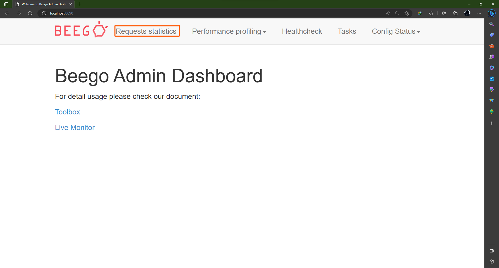</p>

سپس اگر به قسمتی که در شکل مشخص است برویم می توانیم به صورت زنده لیستی از همه درخواست هایی که به سایت زده شده ببینیم.

به عنوان مثال اگر یک بار درخواست زیر را بفرستیم و سپس به صفحه ی پیش فرض `monitoring` نگاه کنیم می توانیم آن درخواست را ببینیم.

```html
http://localhost:8080/dashboard
```

<p align=center>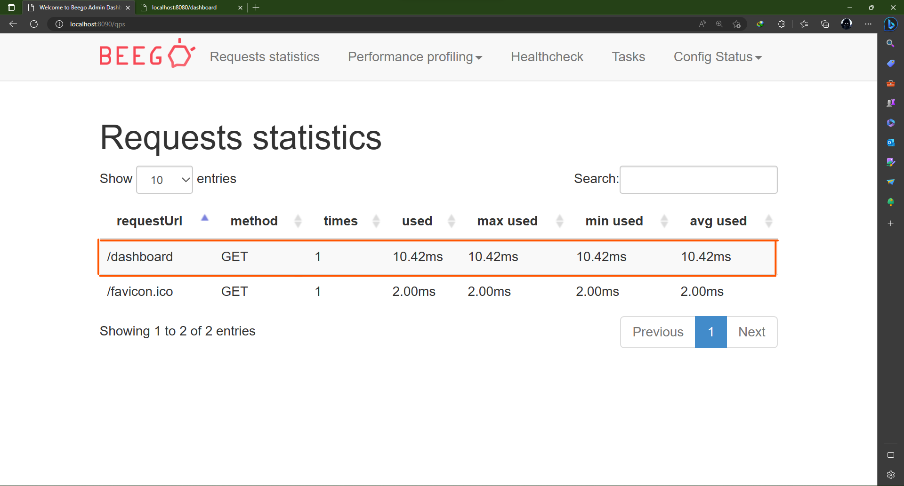</p>

## مستقر کردن برنامه روی دستگاه local

برای اینکه بتوانیم پروژه خود را `deploy` کنیم کافی است خط زیر را به فایل `app.conf` اضافه کنیم.

```golang
beego.RunMode = "prod"
```

برای مطالعه در مورد انواع `runmode` می توانید به این [سایت](https://github.com/beego/beedoc/blob/master/en-US/mvc/controller/config.md) مراجعه کنید.

سپس کافی است فولدر های `conf` ، `static` ، `views` را به همراه فایل قابل اجرای پروژه در یک فولدر جدید بریزید به عنوان مثال به صورت زیر می توانید کار کنید.

<p align=center>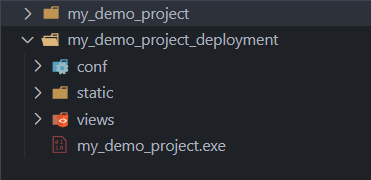</p>

اکنون می توانید با هر کامندی که می خواهید بسته به سیستم عامل خود این پروژه را در پس زمینه اجرا کنید. به عنوان مثال در windows با رفتن به فولدر جدیدی که ساختیم و با استفاده از دستور زیر می توانیم پروژه را اجرا کنیم.

```bash
start ./my_demo_project.exe
```

و یا در linux با استفاده از دستور `nohup` می توانید این کار را انجام دهید.

## مستقر کردن برنامه روی nginx

### نصب و راه اندازی

در ابتدا باید `nginx` را نصب کنید.
برای این کار در windows می توانید با دانلود کردن فایل آن از [سایت](https://nginx.org/en/download.html) اصلی `nginx` این کار را انجام دهید و در linux هم می توانید با استفاده از دستور زیر این کار را انجام دهید.

```bash
sudo apt update
sudo apt install nginx
```

اکنون اگر فایل قابل اجرا دانلود شده را اجرا کنید و به URL زیر بروید می بینید که `nginx` روی پورت `80` اجرا شده.

```html
http://localhost:80
```

<p align=center>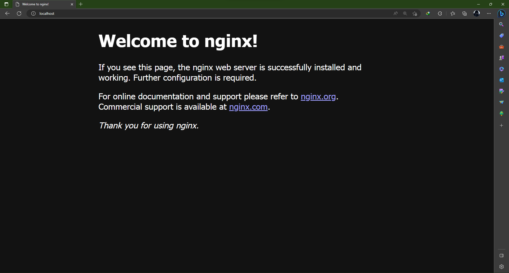</p>

برای مستقر کردن پروژه روی nginx کافی است ابتدا به فولدری که nginx را نصب کردید بروید و سپس به فایل `nginx.conf` در فولدر conf رفته و خط های مشخص شده در شکل را تغییر دهید.

<p align=center>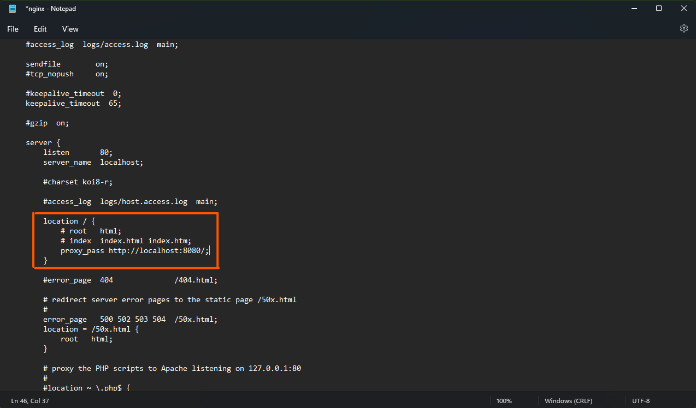</p>

اکنون اگر دوباره nginx را اجرا کنید و سپس پروژه را اجرا کنید خواهید دید که وقتی در مرورگر URL زیر را می نویسید همان پروژه را برای شما می آورد.

```html
http://localhost:80
```

در این بخش سعی کردیم که یک پروژه با اجزای شبیه به یک پروژه واقعی را بسازیم و با برخی از ابزار های پرکاربرد دنیای امروز کار کنیم. برای مطالعه بیشتر هم می توانید از منابع زیر استفاده کنید.

## منابع
- https://pkg.go.dev/github.com/astaxie/beego
- https://github.com/beego/beego-doc/blob/main/docs/en-US/README.md
- https://www.youtube.com/watch?v=s1RSXRCxR6U&t=221s&ab_channel=FreeTechAcademy

</div>